# CELLFORGE

**로봇 셀을 조립하고, 완성한 셀의 일부를 다시 생산 자원으로 편입하는 3D 제조 정책 실험.**

CELLFORGE is a standalone browser-based simulation of synthetic final assembly. It explores the trade-off between shipping finished robot cells and reinvesting them as production resources. It does not control physical equipment or run AI models during simulation.

공장을 늘리면 출하도 늘어날까요? CELLFORGE는 같은 주문·자재·시간 조건에서 **총완성, 출하 가능량, 공장 편입량을 나누어 비교**합니다. 공정과 로봇 동작을 화면으로 살펴보고, 공급 부족·검사 실패·추가 설비 조건을 바꿔 결과를 재현할 수 있습니다.

독립적인 학습 프로젝트이며 공정 시간과 실패율은 합성 모델의 가정입니다. 특정 회사의 프로젝트·도입 성과·실측 공장 모델을 뜻하지 않습니다.

## LS ELECTRIC 경영지원 DT 지원 포트폴리오

**[3페이지 PDF 보기](docs/portfolio/CELLFORGE_LSELECTRIC_DT_Portfolio.pdf)** · 아래 첫 장을 클릭해도 PDF를 열 수 있습니다.

공고의 AI/Digital 기반 업무·운영 혁신 과제 발굴·기획을 위해, 출하 목표에 맞는 개선안을 비교하는 시제품을 만들었습니다. 회사의 공개 DX 방향을 확인하고 **업무 문제 → 대안 비교 → 선택·보류 이유 → 현업 검증안**으로 포트폴리오를 구성했습니다.

- **1장 — 무엇을 검토하나?** 생산량 증가가 출하 증가로 이어지는지 확인하는 문제와 큰 실제 실행 화면입니다. 이 문제는 공개 자료에서 도출한 가상 검토 사례이며 회사의 실제 장애를 확인한 것이 아닙니다.
- **2장 — 무엇을 먼저 검증하나?** 기존 유지·암 조립 설비 추가·검사 실패 가정 개선·완성품 설비 재사용을 비교합니다. 암 설비 추가 시 출하 가능량 15→18대는 다음 검증 후보를 고르는 근거입니다. 비용·공간·안전·실측 확인 전에는 기존 조건 유지로 제안합니다.
- **3장 — AI에게 무엇을 요구했고, 왜 수정했나?** 공고·부서 업무와 실제 쓸모를 다시 검토하고 회사 문제·선택 이유를 보완하도록 요구한 본인 결정 사례를 보여 줍니다. 현업의 목표·기록 확인, 조건 보정, 소규모 시험과 승인 절차는 제안으로 구분합니다.

[대안별 정확한 입력·결과·반복 비교](docs/DECISION_COMPARISON.md) · [회사·공고 근거와 제작 기여](docs/PORTFOLIO_DECISIONS.md) · [실제 요청과 반영 기록](docs/PERSONAL_DECISION.md)

독립 학습용 합성 프로토타입입니다. 김현태가 주제와 방향을 정하고 수정 의견을 제시했으며, Codex가 코드 구현·실험·검증을 지원했습니다.

[](docs/portfolio/CELLFORGE_LSELECTRIC_DT_Portfolio.pdf)

<details>
<summary>2·3장 미리보기 펼치기</summary>

[](docs/portfolio/CELLFORGE_LSELECTRIC_DT_Portfolio.pdf)

[](docs/portfolio/CELLFORGE_LSELECTRIC_DT_Portfolio.pdf)

</details>

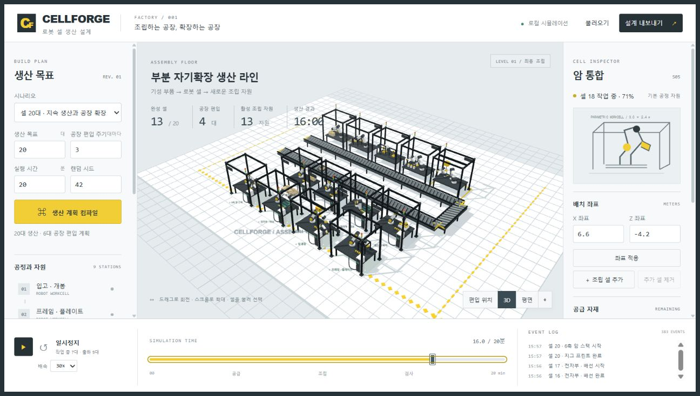

*실제 브라우저 화면 · 2026.10.10 · 공장에 가까이 다가간 시점. 기본 20대 확장 조건의 16분 시점: 완성 13대, 편입 4대, 사용 가능한 생산 자원 13개. 로봇 동작은 작업 기록의 진행률을 시각화합니다.*

### 설비를 가까이 보기

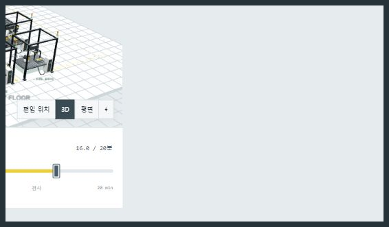

*위 실행 화면에서 공장 부분만 캡처했습니다. 앞줄은 완성한 셀을 다시 사용한 조립 설비, 뒤쪽은 기존 공정이며 가운데 컨베이어가 보입니다. 로봇 동작은 작업 기록을 보여 주는 시각화이고, 이동·충돌·안전 계산은 포함하지 않습니다.*

## 1분 안에 시작하기

Git, Python, WebGL을 지원하는 브라우저가 있으면 시작할 수 있습니다. 별도의 API 키·외부 CDN·npm 패키지 설치는 필요 없습니다.

```sh
git clone https://github.com/Kimhyuntae9665/cellforge.git
cd cellforge
```

Windows PowerShell:

```powershell
python -m http.server 8767 --bind 127.0.0.1
```

macOS / Linux:

```sh
python3 -m http.server 8767 --bind 127.0.0.1
```

브라우저에서 [http://127.0.0.1:8767](http://127.0.0.1:8767)을 열고 아래쪽 **▶**를 누르세요. 시간 슬라이더를 오른쪽 끝으로 옮기면 바로 20분 결과를 볼 수 있습니다. 서버는 터미널에서 `Ctrl+C`로 종료합니다.

`index.html`을 더블클릭하면 ES 모듈을 읽지 못할 수 있으므로 HTTP 서버로 여세요. 포트가 사용 중이면 서버 명령과 브라우저 주소의 `8767`을 같은 다른 번호로 바꾸면 됩니다.

## 첫 실험: 확장과 출하는 다른 지표

아래 결과는 **UI 초기 조건**을 기준으로 합니다. `engine.js`의 인수 없는 기본 설정은 목표 8대이므로, 코드를 직접 호출할 때는 비교 입력을 명시해야 합니다.

| 공통 조건 | 값 |
| --- | --- |
| 주문 / 공급 자재 | 20대 / 20대분 |
| 관찰 시간 / 랜덤 시드 | 20분 / 42 |
| 첫 검사 실패 확률 / 설치 시간 | 12% / 45초 |
| 사전에 구매한 추가 설비 | 없음 |

| 정책 | 총완성 | 출하 가능 | 공장 편입 | 설치 중 | 재공 |
| --- | ---: | ---: | ---: | ---: | ---: |
| 편입 주기 `0` · 편입 없음 | 15대 | 15대 | 0대 | 0대 | 5대 |
| 편입 주기 `3` · 3대마다 편입 | 19대 | 13대 | 6대 | 0대 | 1대 |

확장 조건에서는 완성량이 4대 늘었지만 출하 가능한 셀은 2대 줄었습니다. 완성한 6대를 생산 자원으로 사용했기 때문입니다. **완성 = 출하 가능 + 설치 중 + 공장 편입**입니다. 출하 가능량은 모델에서 출하할 수 있는 수량이지 실제 판매·배송 실적이 아닙니다. 이 결과만으로 매출 증가나 투자 회수기간을 계산하지 않습니다.

1. 새로 열린 기본 화면에서 시간 슬라이더를 **20분**으로 옮겨 확장 결과를 확인합니다.
2. 왼쪽 **공장 편입 주기**를 `0`으로 바꾸고 **생산 계획 컴파일**을 누릅니다.
3. 다시 슬라이더를 20분으로 옮깁니다. 다른 입력과 초기 설비 수는 그대로 둡니다.
4. **실행 결과 JSON ↓**으로 입력·작업 기록·결과를 저장합니다.

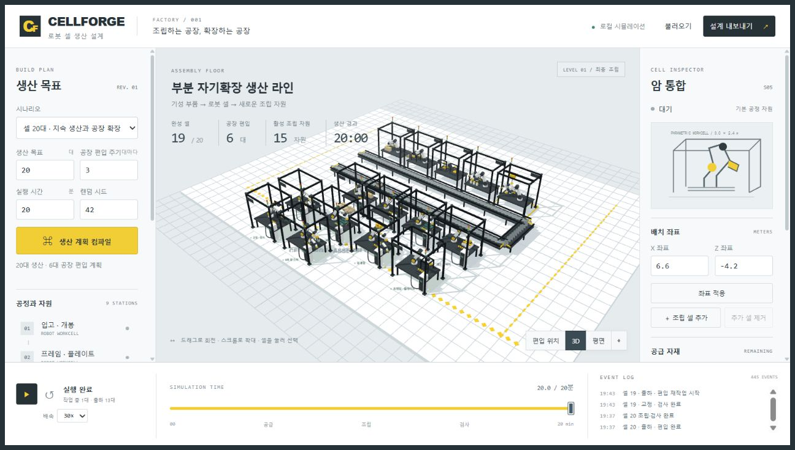

*20분 · 시드 42 · 추가 초기 설비 없음. 완성 19대 중 6대가 공장에 편입되어 출하 가능한 수량은 13대입니다.*

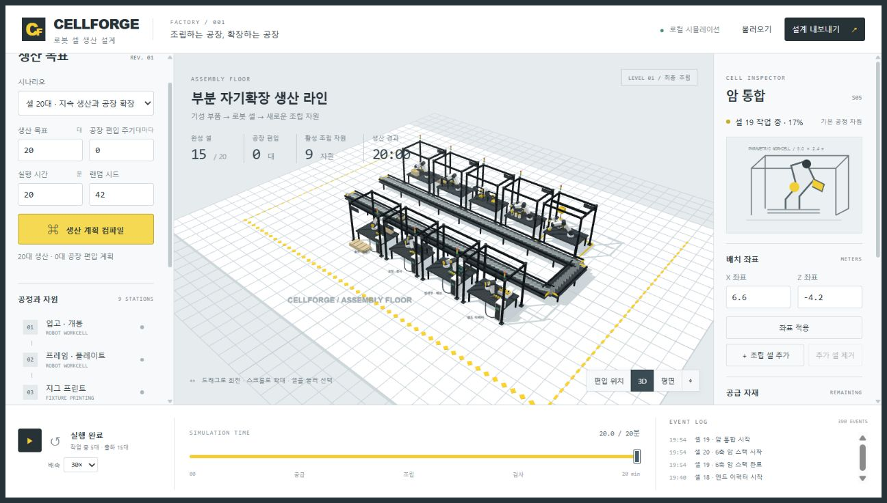

*같은 주문·자재·시간·시드에서 편입 주기만 0으로 변경한 결과. 완성 15대, 편입 0대, 출하 가능 15대입니다.*

자동 비교로 10·20·40분 관찰 시간과 시드 1~30의 동일 시드 쌍을 확인할 수 있습니다.

```sh
npm run compare
```

시드 변화는 합성 모델의 입력 변동 확인이며, 현장 데이터로 보정한 신뢰구간이나 실증 성과가 아닙니다.

## 화면에서 할 수 있는 일

| 하고 싶은 일 | 조작 |
| --- | --- |
| 공장 둘러보기 | 드래그로 회전, 휠로 확대, **평면 / 3D / 전체 공장 보기** 전환 |
| 공정 상태 보기 | 왼쪽 공정 목록 또는 3D 셀 바닥 선택 |
| 시간 이동 | ▶ 재생, ↺ 초기화, 배속 변경, 시간 슬라이더 이동 |
| 생산 조건 변경 | 목표·편입 주기·시간·시드 입력 후 **생산 계획 컴파일** |
| 공급 부족과 복구 | **자재 공급 부족** 시나리오 선택 후 **장애 복구** |
| 검사 실패 경로 | **검사 실패와 복구** 시나리오 또는 **검사 실패 주입** |
| 구매한 설비 추가 | 지원하는 조립 공정 선택 후 **＋ 조립 셀 추가** |
| 시각적 배치 변경 | 셀 선택 → X/Z 좌표 입력 → **좌표 적용** |
| 조건 보존·재현 | **설계 내보내기** → JSON 저장 → **불러오기** |
| 결과·개념 기하 저장 | **실행 결과 JSON ↓ / 프레임 STL ↓** |

실패 주입과 복구 버튼은 **조건을 바꾸고 처음부터 다시 계산**합니다. 실행 중 실제 공장에 명령을 보내는 기능이 아닙니다. [단계별 사용법](docs/USAGE.md)에서 버튼별 순서와 결과 읽는 법을 확인하세요.

## 실제 화면으로 둘러보기

아래 이미지는 실제 브라우저 캡처입니다. 추가 설비·공급 부족·강제 검사 실패 실험은 기본 비교와 입력이 다릅니다.

### 평면 시점

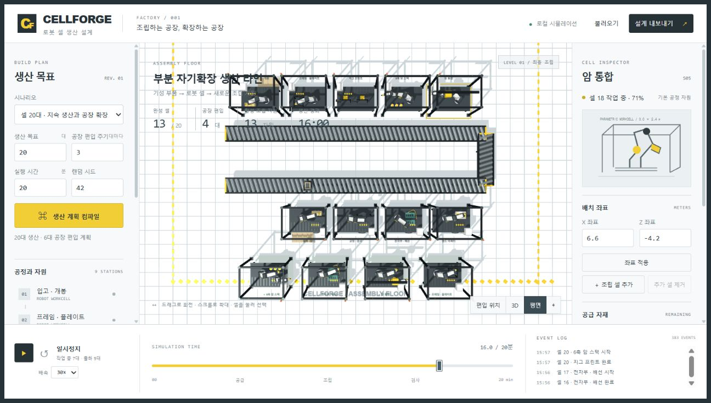

*평면 버튼으로 전환한 화면. X/Z 좌표는 배치를 보기 위한 값이며 이동 거리나 충돌에 따른 처리량 계산에는 사용하지 않습니다.*

### 외부 부품 부족

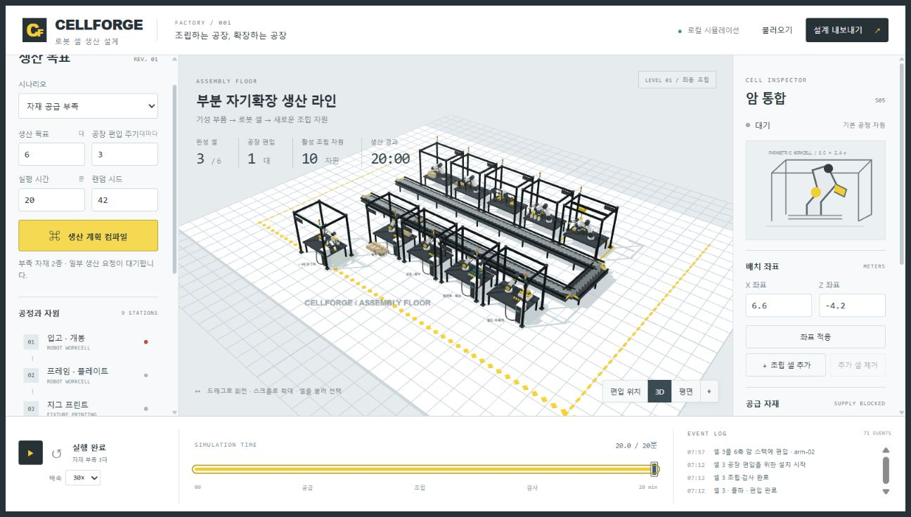

*자재 공급 부족 프리셋: 주문 6대 중 3대가 완성되고 3대가 자재를 기다립니다. 필요한 부품이 모두 있어야 생산을 시작합니다.*

### 외부에서 부족분 보충

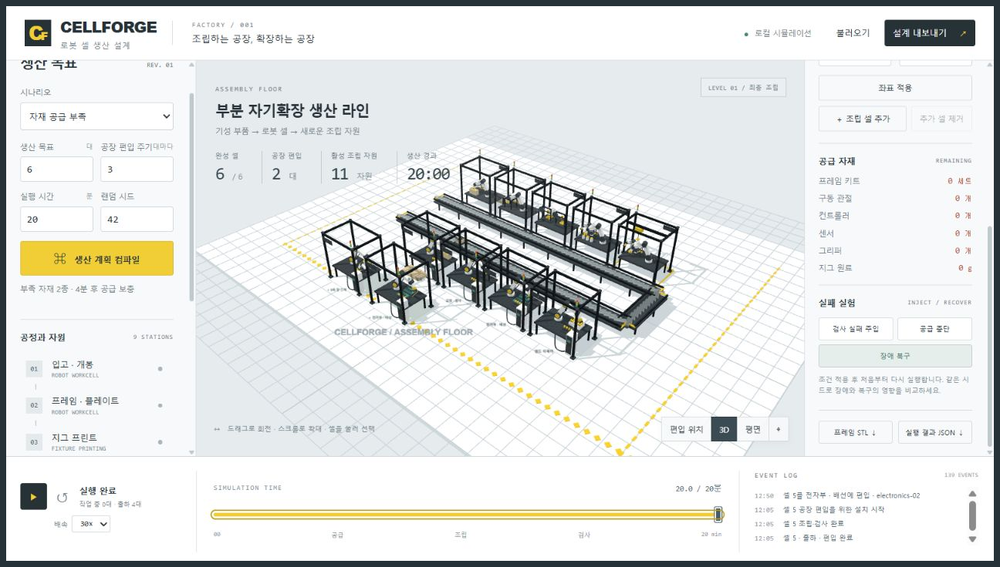

*장애 복구로 4분 후 부족분을 외부 공급받는 조건을 적용한 재실행. 6대 완성, 2대 편입, 4대 출하 가능 상태입니다. 부족한 부품을 자체 제조한 결과가 아닙니다.*

### 검사 실패와 재작업

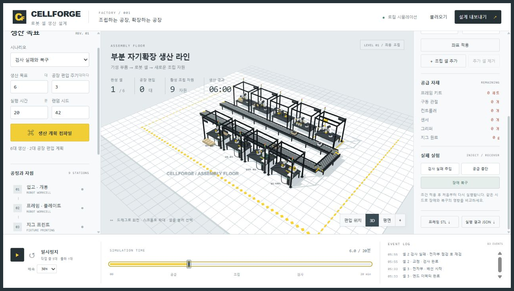

*검사 실패 조건의 작업 기록. 첫 검사 실패 후 전자부 점검을 거쳐 다시 검사합니다. 재검에도 실패한 제품은 격리되어 완성과 편입에서 제외됩니다.*

### 사전 구매 자원과 배치

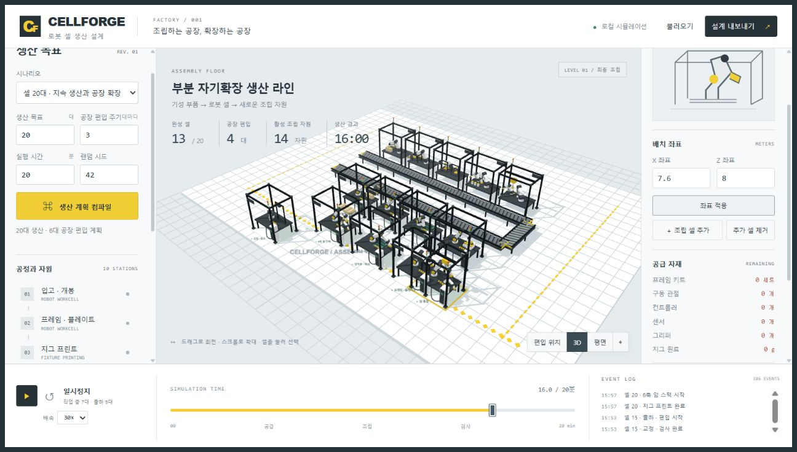

*추가 초기 설비는 이미 구매·설치한 자원이며 생산 실적에 포함하지 않습니다. 설비 추가는 실제 스케줄 용량을 바꾸지만 좌표만 옮기는 것은 처리량을 바꾸지 않습니다.*

### 모바일 패널

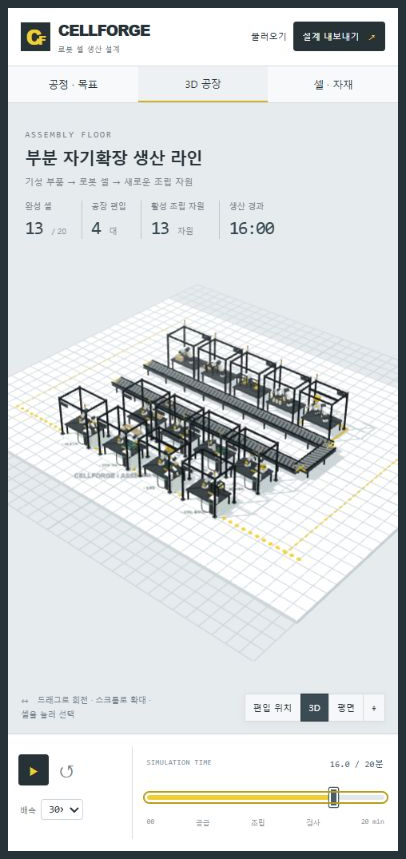

*좁은 화면에서 공정·목표, 3D 공장, 셀·자재 패널을 전환합니다. 동일한 모델과 시간 슬라이더를 사용합니다.*

### 잘못된 입력

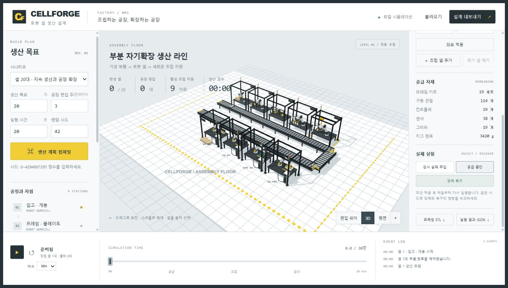

*범위를 벗어난 입력을 거부하는 화면. 유효하지 않은 계획으로 기존 실행 결과를 덮어쓰지 않습니다. 허용 범위는 [사용법](docs/USAGE.md#입력-범위와-오류-처리)을 확인하세요.*

## 어떻게 동작하나요?

화면 조작과 생산 계산을 분리했습니다. 엔진은 입력 조건으로 전체 작업 기록을 만들고, 시간 슬라이더는 그 기록의 특정 시점 상태를 보여줍니다. 배속은 화면 재생 속도이며 생산 조건을 바꾸지 않습니다.

```text
index.html + styles.css
        │ 화면 입력 / 표시
      app.js
        ├─ engine.js ─ 입력 검증 → 계획 → 작업 기록 → 시점별 상태
        └─ scene.js  ─ 상태 + 시각적 배치 → Three.js 화면

JSON 레시피 ─ 입력 조건 + 배치 저장 / 다시 불러오기
JSON 결과   ─ 작업 기록 + 수량 + 자재 + 내보낸 시점
STL         ─ 가정 치수의 개념 프레임 기하
```

기본 공정은 입고·개봉 → 프레임·플레이트 → 지그 프린트 → 6축 암 스택 → 암 통합 → 엔드 이펙터 → 전자부·배선 → 교정·검사 → 출하·편입의 9개입니다. 구매 부품을 예약한 제품만 공정에 들어갑니다. 각 자원은 한 번에 한 작업을 처리하고 새 자원은 완성 후 설치 시간이 지난 뒤부터 작업을 맡습니다.

| 파일 | 역할 |
| --- | --- |
| [`engine.js`](engine.js) | 입력·레시피 검증, 자재 예약, 스케줄, 편입·재작업·격리, 시점별 수량, STL |
| [`app.js`](app.js) | UI 상태, 프리셋, 재생·시간 이동, 추가 자원, JSON 입출력 |
| [`scene.js`](scene.js) | Three.js 셀·컨베이어·로봇 포즈, 카메라, 선택·배치 |
| [`index.html`](index.html) / [`styles.css`](styles.css) | 화면 구조와 반응형 패널 |
| [`tests.mjs`](tests.mjs) | 엔진 자동 테스트 12개 |
| [`scripts/compare.mjs`](scripts/compare.mjs) | 정책·관찰 시간·시드 비교 |
| [`MODEL.md`](MODEL.md) | 가정, 수량 보존식, 편입 정책, STL 범위 |
| [`VERIFICATION.md`](VERIFICATION.md) | 검증 기록과 재현 범위 |
| [`docs/PUBLISH_CHECKS.md`](docs/PUBLISH_CHECKS.md) | 공개본의 실제 화면 10개와 조작·결과 검수 |
| [`docs/USAGE.md`](docs/USAGE.md) | 단계별 조작·재현·문제 해결 |
| [`example-recipe.json`](example-recipe.json) / [`example-results.json`](example-results.json) | 실제 브라우저 내보내기 예제. **수동 초기 자원 1개 포함** |
| [`example-frame.stl`](example-frame.stl) | 개념 프레임 예제 |
| [`vendor/`](vendor/) | 로컬 Three.js 모듈, OrbitControls, 원래 라이선스 |

## 테스트와 재현

Node.js의 내장 테스트 실행기를 사용합니다. Node.js 22에서 검증했으며 프로젝트 루트에서 실행하세요. 앱을 브라우저로 사용하기만 할 때는 Node.js가 필요하지 않습니다.

```sh
npm test
npm run compare
```

`npm test`는 자동 테스트 12개를 실행합니다. 동일 입력의 재현, 수량 보존과 재고 비음수, 자원별 작업 비중첩, 설치 전 가동 금지, 외부 공급 보충, 재작업·재검·격리, 종료 이후 완료 제외, 추가 자원, 레시피 왕복, 개념 STL 좌표를 확인합니다.

자동 테스트 통과는 현장 성능·안전성·제조 적합성의 검증을 뜻하지 않습니다. 예제 레시피에는 `integrate` 공정의 `manual-1` 초기 자원이 있으므로 **추가 자원이 없는 기본 정책 비교와 구분**하세요. 엔진의 `DEFAULT_CONFIG`는 목표 8대이고 UI는 20대 조건으로 시작합니다.

## 가정과 한계

- 공정 시간·검사 실패 확률·설치 시간은 합성 입력이며 실제 공장 데이터로 보정하지 않았습니다.
- 구매 부품의 최종 조립을 다룹니다. 관절·컨트롤러·반도체를 만드는 완전 자기복제 공장이 아닙니다.
- 물류 이동·공간 충돌·버퍼 막힘·작업자·다제품 혼류는 계산하지 않습니다.
- 로봇 포즈는 진행률의 시각화입니다. 역기구학, 힘·접촉, 물리 충돌, 안전 제어는 구현하지 않았습니다.
- 실물 로봇, PLC, MES, LLM, 비전 모델, 학습·추론 시스템은 연결하지 않았습니다.
- 공간 배치는 시각적입니다. X/Z 좌표 변경은 처리량에 영향을 주지 않습니다.
- 설치비·유지비·판매 가격·품질 비용을 계산하지 않으며 투자 회수기간을 제공하지 않습니다.
- STL은 가정 치수의 여러 닫힌 보로 구성한 개념 기하입니다. 체결·공차·하중·Boolean 합집합·제조 적합성을 확인한 CAD가 아닙니다.

## 참고 자료와 제작 기여

공장 장면과 부분 자기확장 아이디어의 영감은 사용자가 지정한 [X 원본 게시물](https://x.com/ihorbeaver/status/2107210345051988131)입니다. 화면과 3D 기하는 별도로 구현했고 저장소의 모든 스크린샷은 CELLFORGE 실행 화면입니다. 모델의 가정과 검증은 이 저장소의 코드·테스트·문서에서 확인할 수 있습니다.

| 주체 | 기여 |
| --- | --- |
| 김현태 | 제조 주제 선정·참고 영상 지정, 업무 관련성 재검토 요구, 회사 문제·선택 이유와 화면 설명을 보완하도록 수정 방향 지정 |
| Codex AI Agent | 코드 구현, 비교 실험, 테스트, 문서 제작 |

AI는 제작·조사·검수 과정에 사용했습니다. 실행 중 시뮬레이션은 JavaScript 엔진으로 동작하며 LLM을 호출하지 않습니다.

## 라이선스

프로젝트 자체에는 현재 별도 라이선스를 부여하지 않았습니다. 포함된 Three.js와 OrbitControls의 MIT 라이선스는 [`vendor/LICENSE.txt`](vendor/LICENSE.txt)에 보존했습니다. 출처와 적용 범위는 [Third-party notices](THIRD_PARTY_NOTICES.md)에 정리했습니다.
