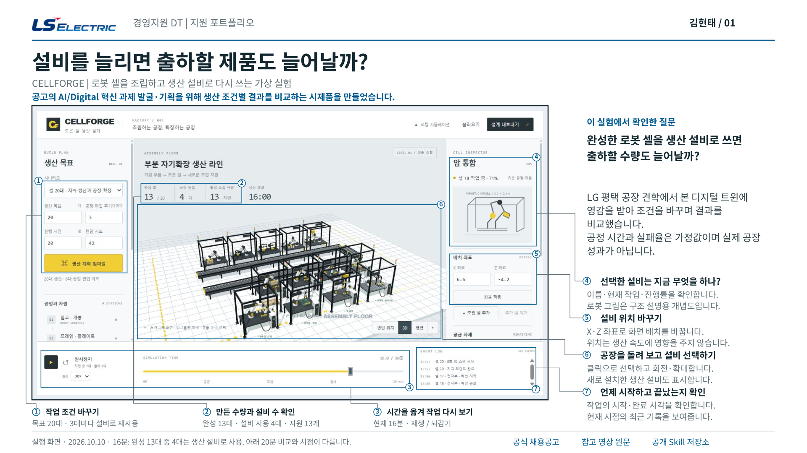
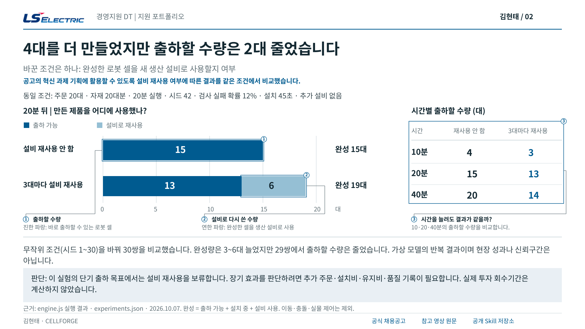
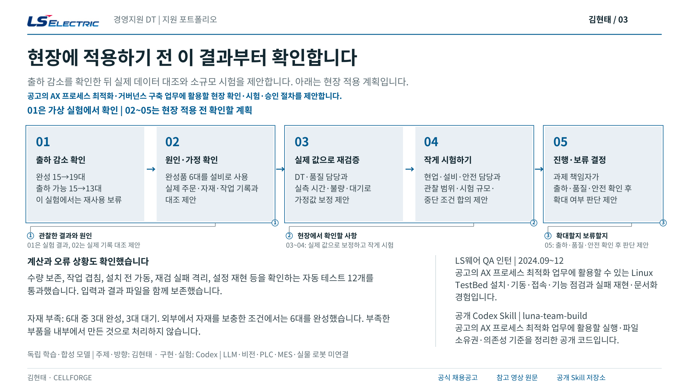

# CELLFORGE 포트폴리오

[최신 PDF](CELLFORGE_LSELECTRIC_DT_Portfolio.pdf) · 2026-10-10 · 3페이지

독립 학습용 합성 모델입니다. 1~2장은 실행과 비교 결과, 3장은 현장 적용 전 검토 계획입니다.
공고의 AI/Digital 혁신 과제 발굴·기획을 위해 생산 조건별 결과를 비교하는 시제품을 만들었습니다.
새 설비 캡처와 얇은 영역 사각형·연결선을 반영했습니다. SHA256은 sha256.json에 있습니다.
